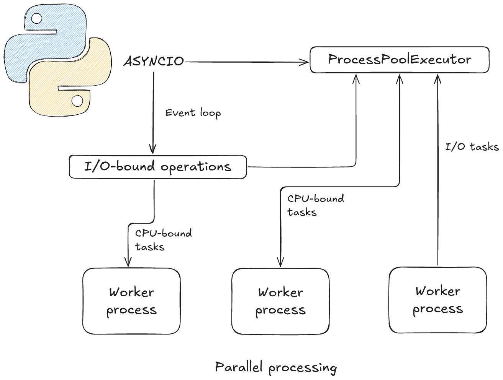

# Analyseur de texte distribué

## Objectif

Mettre en place un système distribué capable de :

* Consommer efficacement un grand volume de messages RabbitMQ.
* Traiter chaque message avec une tâche métier lourde (analyse de texte).
* Stocker les résultats dans MongoDB.
* Réémettre un message final une fois le traitement terminé.
* Tester la charge avec un simulateur

## Stack technique

| Composant             | Rôle                                                |
|-----------------------|-----------------------------------------------------|
| **RabbitMQ**          | Broker de messages AMQP pour ingestion des messages |
| **aio-pika**          | Client Python asynchrone pour RabbitMQ              |
| **MongoDB**           | Base de données NoSQL pour stocker les résultats    |
| **motor**             | Client MongoDB asynchrone pour Python               |
| **Docker Compose**    | Orchestration locale de tous les services           |
| **loadgen**           | Générateur de messages pour tests                   |

---

## Justification des choix techniques

### Pourquoi `aio-pika` ?

* Client AMQP asynchrone : idéal pour les systèmes `asyncio`
* Permet une consommation non bloquante des messages RabbitMQ
* Plus simple et plus moderne que `pika` synchrone
* Plus simple à scaler dans une boucle event-based que `pika`
* Gère reconnect, QoS, ack explicites, publication, etc.
* Compatible avec le traitement asynchrone + ProcessPoolExecutor

### Pourquoi `motor` ?

* Driver officiel MongoDB asynchrone
* Parfait pour insérer / mettre à jour des documents sans bloquer
* S’intègre nativement avec `asyncio`, compatible avec `aio-pika`
* Plus performant que `pymongo` dans des applications concurrentes

Ces deux choix permettent de traiter efficacement des messages en continu, gèrent bien la montée en charge et (point de vue personnel) ne bloquent jamais **inutilement** la boucle d'événements.

### Pourquoi `asyncio` + `ProcessPoolExecutor` ?

* `asyncio` permet d’orchestrer efficacement un flux continu de messages et d’opérations I/O (MongoDB, RabbitMQ) sans bloquer
* Idéal pour une architecture réactive, événementielle et faiblement consommatrice de threads
* `ProcessPoolExecutor` permet d’exécuter en parallèle des traitements **CPU-bound** (ex. : scoring, NLP, parsing)
* Combine le meilleur des deux mondes : réactivité non bloquante + puissance de calcul parallèle
* Permet de découpler la logique métier lourde du flux principal, sans impacter la performance globale

Cette architecture permet d’orchestrer efficacement un flux massif de messages RabbitMQ tout en traitant en parallèle des tâches métier lourdes.

* `asyncio` gère les opérations non bloquantes : consommation RabbitMQ, insertion MongoDB, publication, etc.
* Les tâches CPU-intensives sont déléguées à des workers via `ProcessPoolExecutor`, libérant ainsi la boucle d’événements principale.



---

## Modules du projet

### 1. `worker/` — Service d’analyse principal

* `aio-pika` pour la consommation RabbitMQ
* `motor` pour la persistance MongoDB
* `ProcessPoolExecutor` pour le traitement CPU-bound
* Publication d’un message traité (file `processed_texts`)

### 2. `loadgen/` — Simulateur de charge

* Génère un volume massif de messages `update` ou `delete`

---

## Structure du projet

```bash
project/
├── assets/                         # Images (schémas, docs, etc.)
│   └── Parallel_processing.png

├── docker-compose.yml              # Orchestration des services (RabbitMQ, MongoDB, etc.)
├── .gitignore                      # Fichiers et dossiers à ignorer par Git
├── pyproject.toml                  # Config pour black et isort
├── Makefile                        # Commande utile

├── worker/                         # Service principal : analyse de texte
│   ├── Dockerfile
│   ├── .dockerignore
│   ├── setup.py
│   ├── pytest.ini
│   ├── requirements.txt
│   ├── requirements-test.txt

│   ├── app/                        # Logique métier
│   │   ├── consumer.py
│   │   ├── main.py
│   │   ├── processing.py
│   │   ├── publisher.py
│   │   ├── storage.py
│   │   └── models/
│   │       └── message_data.py

│   └── core/                       # Utilitaires techniques
│       └── logging_wrapper.py

│   └── tests/                      # Tests du code
│       └── test_delete_process.py
│       └── test_message_data.py
│       └── test_message_data_errors.py
│       └── test_processing.py
│       └── test_publisher.py
│       └── test_update_process.py

├── loadgen/                        # Générateur de charge RabbitMQ
│   ├── main.py
│   ├── config.yaml
│   └── ...

├── logs/                           # Fichiers log montés via volume


```

---

## Fonctionnement

1. **RabbitMQ** reçoit des messages JSON dans une queue (`incoming_texts`) contenant un type (`update`, `delete`) et des données à analyser.
2. Le **worker Python (asynchrone)** consomme les messages via `aio-pika`.
3. Le traitement métier (analyse de texte) est exécuté dans un **`ProcessPoolExecutor`** pour ne pas bloquer l'event loop.
4. Une fois l’analyse terminée, les résultats sont enregistrés dans **MongoDB**.
5. Un **message final** est publié dans une autre queue RabbitMQ (`processed_texts`).
6. En cas d'échec de traitement d'un message, il sera publié dans (`failed_texts`) avec **dead-letter exchange**

---

## Execution

### 1. Pré-requis

Assurez-vous d’avoir :

- [Docker](https://www.docker.com/)
- [Docker Compose](https://docs.docker.com/compose/)
- (Optionnel) `make`, sinon utilisez les commandes manuelles

---

### 2. Lancement des services

Depuis la racine du projet :

```bash
make build
make up
```
Ou manuellement :
```bash
docker-compose build
docker-compose up -d
```


Cela démarre :
- RabbitMQ + management UI (http://localhost:15672)
- MongoDB
- Worker d’analyse de texte

> Identifiants RabbitMQ (par défaut) :
> ```
> user: guest
> pass: guest
> ```

---
### 3. Structure message attendu

```json lines
{
  "id": "msg_158",
  "user_id": "u_2301322",
  "text": "texts",
  "timestamp": "2025-07-06T13:35:15.598473",
  "type": "update"
}
```

En cas de `update`, les champs suivants sont optionnels : 
- user_id
- timestamp

En cas de `delete`, les champs suivants sont optionnels : 
- user_id
- text
- timestamp

---

# Générateur de charge — `loadgen/`

Ce module permet de simuler l’envoi massif de messages vers **RabbitMQ** ou **MongoDB** pour tester les performances du système d’analyse de texte.

---

## Structure

| Fichier              | Rôle                                                           |
|----------------------|----------------------------------------------------------------|
| `main.py`            | Point d'entrée CLI pour choisir la cible (`rabbit` ou `mongo`) |
| `rabbit_sender.py`   | Génère des messages `update` / `delete` dans RabbitMQ          |
| `mongo_sender.py`    | Insère directement des documents fictifs dans MongoDB          |
| `config.yaml`        | Fichier de configuration pour les volumes et la cible          |
| `requirements.txt`   | Dépendances Python nécessaires                                 |

---

## Conseils

- Lancer `docker-compose up` avant de démarrer `loadgen`.
- Observer l’effet en temps réel dans :
  - RabbitMQ ui (`localhost:15672/#/queues`)
- Vérifier le traitement avec `make logs`.

---

## Préparation

1. Créer un environnement virtuel :

```bash
cd loadgen
python3 -m venv venv
source venv/bin/activate
```

2. Installer les dépendances :

```bash
pip install -r requirements.txt
```

---

## Configuration

Ouvre et modifie le fichier `config.yaml` :

```yaml
cible: rabbit         # 'rabbit' ou 'mongo'
count: 20000          # nombre total de messages à générer
update_ratio: 0.75    # ratio pour faire varier update et delete
```

---

## Utilisation

### Pour injecter dans RabbitMQ :

```bash
python main.py
```
```yaml
cible: rabbit
```

Publie des messages de type `update` ou `delete` dans la queue `incoming_texts`.

---

### Pour remplir directement MongoDB :

```bash
python main.py
```
```yaml
cible: mongo
```
Remplit la collection MongoDB avec des documents aléatoires simulant des messages.

---

### Logs

Les logs du worker sont disponibles :

- **Dans le terminal** :
  ```bash
  make logs
  ```

- **Dans un fichier monté** (avec rotation) :
  ```
  logs/worker.log
  ```

---

## Arrêt propre

```bash
make stop
```

Ou manuellement :

```bash
docker-compose down
```

> Le worker attend la fin des tâches en cours avant de se terminer

---

# Tests unitaire

Le projet utilise `pytest` pour les tests unitaires.

---

## Exécuter les tests

Assurez-vous d’avoir activé votre environnement virtuel :

```bash
python3 -m venv venv
source venv/bin/activate
pip install -e worker
pip install -r worker/requirements-test.txt
```

Puis exécutez les tests :

```bash
make test
```

---

## Auteur

Mohamed Kone
